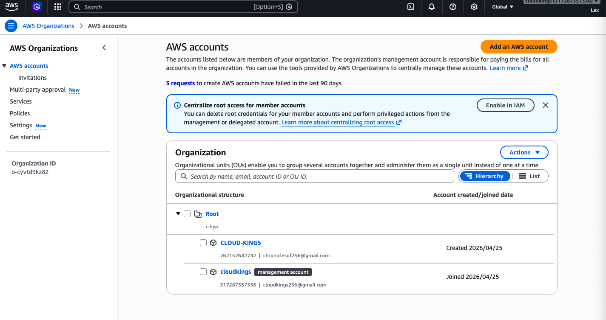
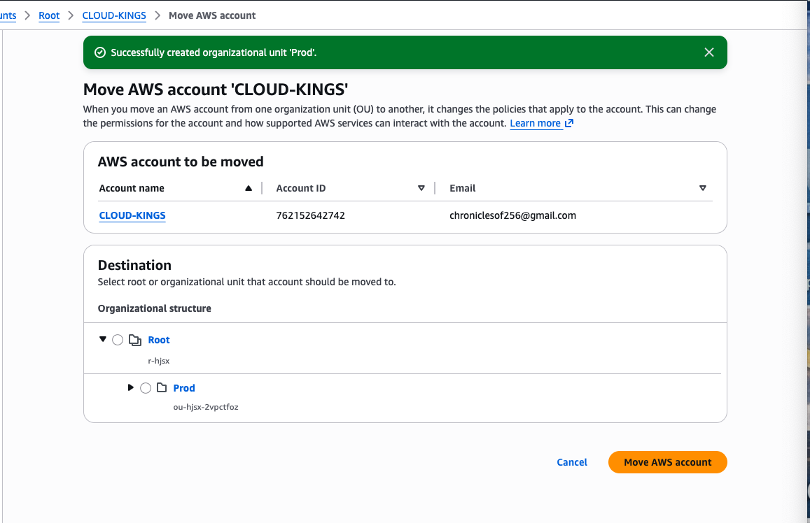
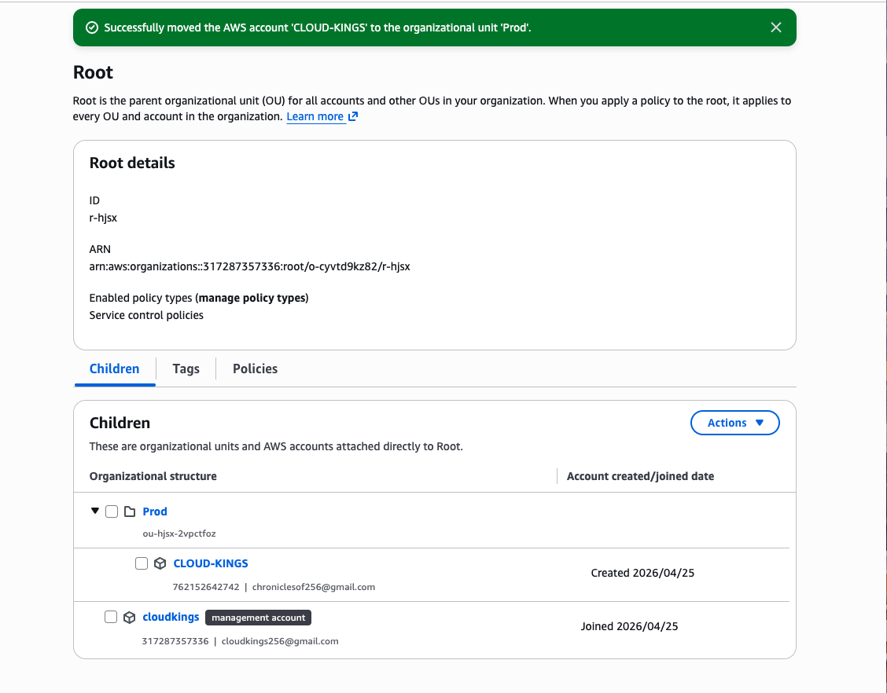
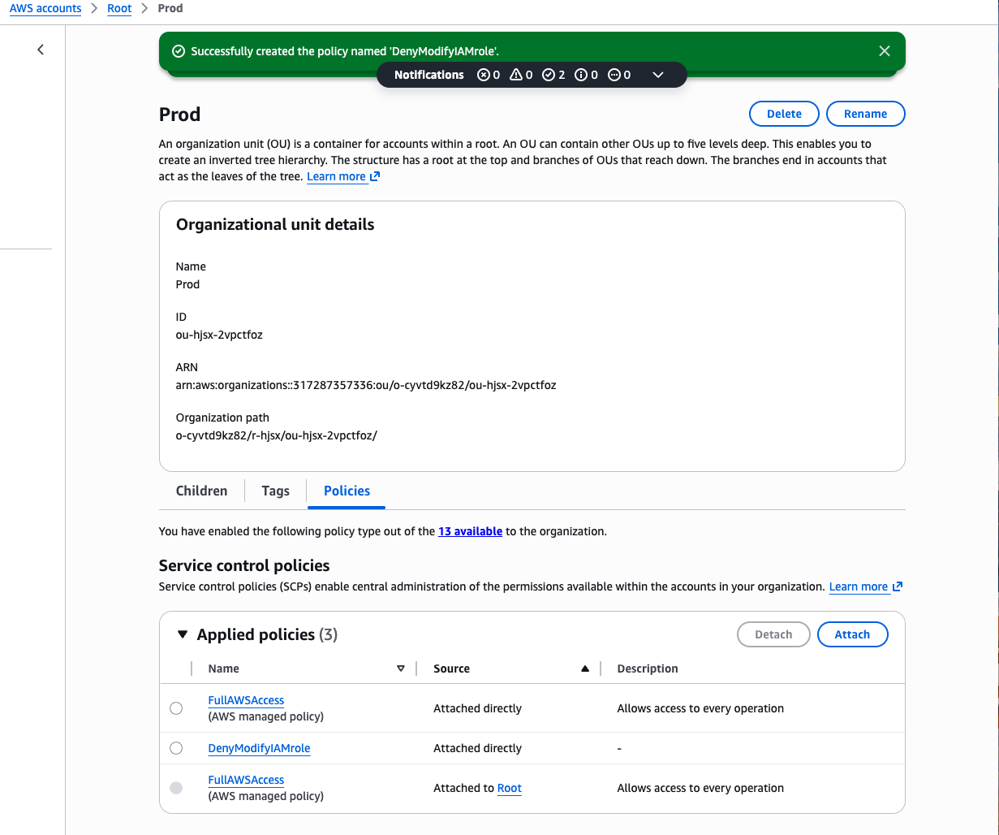
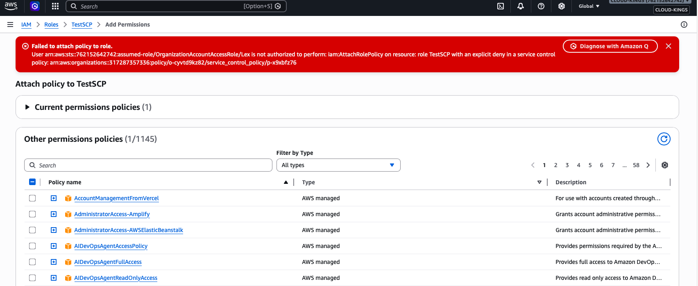

# 🔐 Secure Multi-Account AWS Environment (IAM + Organizations)

## 📌 Overview
Designed and implemented a secure multi-account AWS environment using AWS Organizations, IAM Identity Center (SSO), and IAM roles to enforce least privilege access and centralized identity management.

---

## 🏗️ Architecture

- Management Account (central governance)
- Member Account (CLOUD-KINGS workload account)
- Organizational Unit (Prod) for environment isolation
- IAM Identity Center (SSO) for centralized authentication
- Cross-account IAM roles using STS
- CloudTrail + EventBridge for monitoring and auditing

---

## 🔧 Key Implementations

### AWS Organizations
- Created AWS Organization with centralized management account
- Designed hierarchical structure using Organizational Units (OUs)
- Created "Prod" OU to isolate production workloads
- Moved member account (CLOUD-KINGS) into the Prod OU
- Enabled Service Control Policies (SCPs) for centralized governance

### SCP Enforcement Validation

- Tested Service Control Policy by attempting to attach an IAM policy to a role in a member account
- Action was explicitly denied due to SCP restrictions
- Verified centralized governance and enforcement across AWS accounts
- Demonstrated prevention of unauthorized privilege escalation

### IAM Identity Center (SSO)
- Configured centralized authentication across accounts
- Assigned permission sets:
  - AdministratorAccess
  - ViewOnlyAccess
- Enforced MFA for secure user authentication

### Cross-Account Access (STS)
- Created IAM role for cross-account access
- Configured trust relationship between accounts
- Validated access using AssumeRole functionality

### Monitoring & Logging
- Enabled AWS CloudTrail for audit logging
- Configured EventBridge to detect sensitive actions
- Verified logs in CloudWatch

---

## 🔐 Security Impact

- Reduced risk by isolating production workloads using OUs
- Centralized identity and access management using SSO
- Enforced least privilege access using IAM roles and permission sets
- Improved visibility using CloudTrail and monitoring services
- Eliminated need for shared credentials via secure role assumption

---

## 📸 Implementation Walkthrough

### 1. AWS Organization Created
Established a centralized management account to govern multiple AWS accounts.

---

### 2. Organizational Unit (Prod) Created
Designed an OU structure to isolate production workloads and enforce policies at scale.

---

### 3. Member Account Moved to Prod OU
Organized accounts under the Prod OU to enable centralized governance and policy inheritance.

---
### 4. Service Control Policy (SCP) Created

- Created custom SCP "DenyModifyIAMRole"
- Designed to restrict IAM role modification across accounts

### 5. SCP Attached to OU

- Attached SCP to "Prod" OU
- Enforced centralized governance across member accounts

---

### 6. SCP Enforcement Validation (Access Denied)
Tested SCP by attempting restricted IAM action and confirmed explicit deny, validating enforcement.

## 🎯 Outcome

Successfully built a secure multi-account AWS architecture that simulates real-world enterprise cloud environments with centralized governance, access control, and monitoring.

---

## 🔗 Related Projects

- IAM RBAC & ABAC Lab
- AWS KMS Encryption Lab
- EC2 Security Lab
- Cloud Monitoring Lab
